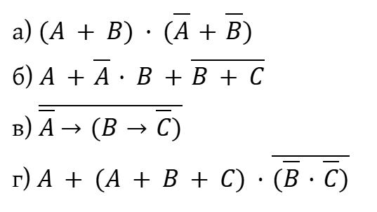

[Назад](/compsci/10a2024.html)

# Задание на 14.02.2025

## Задание 0
Перечитайте в учебнике параграфы 18 и 20. Убедитесь, что вы знаете и умеете применять все законы алгебры логики.

## Задание 1. Синтезируйте логическое выражение по таблице истинности любым способом

1. Для каждой строки, где X = 1, записать выражение, истинное только для неё. Сложить выражения и упростить.
2. Для каждой строки, где X = 0, записать выражение, истинное только для неё. Сложить выражения, упростить, сделать инверсию.

а)

|A|B|X|
|---|---|---|
|0|0|1|
|0|1|0|
|1|0|0|
|1|1|1|

б)

|A|B|C|X|
|---|---|---|---|
|0|0|0|1|
|0|0|1|1|
|0|1|0|0|
|0|1|1|0|
|1|0|0|0|
|1|0|1|0|
|1|1|0|1|
|1|1|1|1|

## Задание 2. Упростите логические выражения

