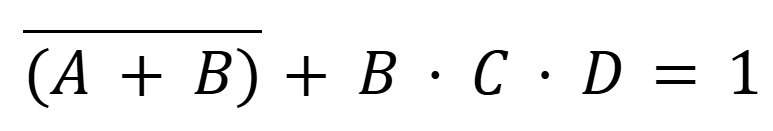

[На главную](https://pkholyavin.github.io)

# Задание на 10.02.2025

## Задание 1

Дан список целых чисел:

```python
numbers = [85, 234, 48, 841, 3, 8, 902, 8563, 4, 0, 800000]
```

Создать новый список, в котором будут только числа, первая цифра которых &ndash; 8. Используйте list comprehension и преобразование чисел в строки (с помощью функции `str()`).

## Задание 2

Дан список строк:

```python
words = ["глаз", "", "боб", "арка", "стол", "", "соус", "ложка", "", "ротор"]
```

Напишите программу, которая для каждой строки в списке:
* если она пустая, выводит сообщение об этом
* если она не пустая, проверяет, равна ли первая буква последней, и выводит сообщение об этом
* если первая буква равна последней, добавляет строку в новый список

Получившийся список нужно вывести на экран. После этого выведите сообщение, в котором укажите, сколько таких слов получилось.


<!-- Найдите все решения логического уравнения



Для этого:
1. Создайте пустой список `solutions`
2. Задайте четыре вложенных цикла по переменным `a, b, c` и `d`.
3. Для каждой комбинации `a, b, c, d` вычислите значение выражения
4. Если выражение равно 1, добавьте в список `solutions` список `[a, b, c, d]`.
5. Выведите список `solutions` на экран построчно. -->
