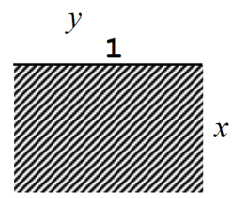
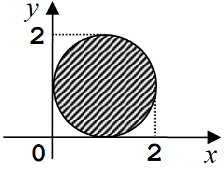
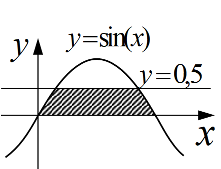

[Назад](/compsci/10b2024.html)

# Задание на 23.12.2024

## Задание 1

Постройте и упростите логические выражения, соответствующие приведённым таблицам истинности. В каждом случае выбирайте наиболее простой способ синтеза. В вашем решении опишите все шаги алгоритма.

1.
|A|B|C|X|
|---|---|---|---|
|0|0|0|0|
|0|0|1|0|
|0|1|0|1|
|0|1|1|1|
|1|0|0|1|
|1|0|1|1|
|1|1|0|1|
|1|1|1|1|

2.
|A|B|C|X|
|---|---|---|---|
|0|0|0|0|
|0|0|1|1|
|0|1|0|0|
|0|1|1|0|
|1|0|0|0|
|1|0|1|1|
|1|1|0|1|
|1|1|1|1|

## Задание 2

Задайте с помощью предиката P(x, y) множество точек, соответствующее заштрихованной области на плоскости.

1. 

2.

3.

## Задание 3

Запишите на языке логики предикатов (см. задание на 16.12), необязательно ограничиваясь предикатами с одной переменной:

1. Каждый студент выполнил по меньшей мере одну лабораторную работу.
2. Каждое чётное число, большее четырёх, является суммой двух простых чисел.

