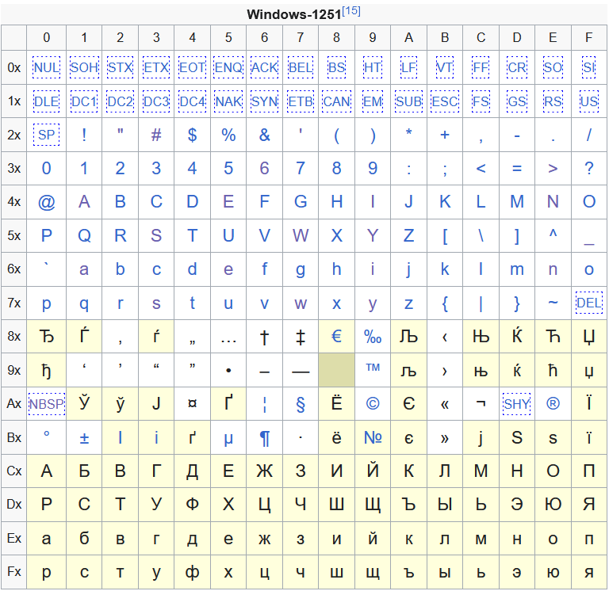

[Назад](/compsci/10b2024.html)

# Задание на 25.11.2024

## Задание 1

Задача 1. В процессе преобразования растрового графического файла количество цветов уменьшилось с 512 до 8. Во сколько раз уменьшился информационный объем файла?

Задача 2. Разрешение экрана монитора – 1024 х 768 точек, глубина цвета – 16 бит. Каков необходимый объем видеопамяти для данного графического режима?

Задача 3. Сколько байт будет занимать код рисунка размером 40×50 пикселей в режиме истинного цвета? при кодировании с палитрой 256 цветов?

Задача 4. Для хранения растрового изображения размером 128 x 128 пикселей отвели 4 килобайта памяти. Каково максимально возможное число цветов в палитре изображения? 

## Задание 2

В кодировке UTF-8 на один символ отводится от 1 до 4 байт. Чтобы выполнялось условие Фано, в каждом случае первые несколько бит в каждом байте кода должны быть строго определены. См. таблицу:

|Количество байт |	Шаблон |
|---|---|
|1|`0xxxxxxx`|
|2|`110xxxxx 10xxxxxx`|
|3|`1110xxxx 10xxxxxx 10xxxxxx`|
|4|`11110xxx 10xxxxxx 10xxxxxx 10xxxxxx`|

В кодировке Windows-1251 на каждый символ отводится 1 байт. В таблице ниже (источник &mdash; [Википедия](https://en.wikipedia.org/wiki/Windows-1251#Character_set)) приведены все коды кодировки (по строкам &mdash; первая шестнадцатеричная цифра кода, по столбцам &mdash; вторая). 

Найдите как можно больше разных кириллических символов, удовлетворяющих шаблонам UTF-8 (для этого придётся вспомнить, как связаны шестнадцатеричные числа и двоичные), и сконструируйте из них корректный UTF-8 файл. Для этого запишите найденные вами символы в нужном порядке в программе Блокнот, сохраните файл в кодировке ANSI (так там называется Windows-1251), а потом закройте его, откройте пустой блокнот, нажмите "Открыть" и выберите свой файл с кодировкой UTF-8.

Например, последовательность символов `Пё` (`П` = `CF`16 = `11001111`2, `ё` = `B8`16 = `10111000`2) при таком преобразовании даст символ `ϸ` (`11001111 10111000`).

## Задание 3*

Для тех, кто планирует участвовать в олимпиаде по лингвистике, а также для всех желающих: решите задачу на [язык на’ви](numerals.html), тщательно оформите решение с пояснениями и сдайте мне на проверку.