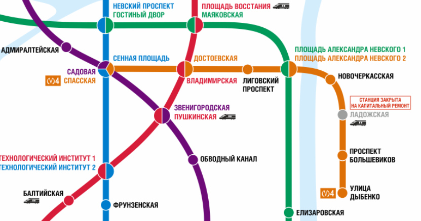

[Назад](/10b2024.html)

# Задание #3 на 18.11.2024 (метро)

1. Изучите [схему Санкт-Петербургского метрополитена](https://metro.spb.ru/map/route.html).

2. Изобразите центральную часть схемы в виде ориентированного графа, если учесть, что из каждой станции можно выехать либо в северном направлении, либо в восточном. Присвойте каждой дуге вес, соответствующий времени поездки между двумя станциями в минутах (определите по схеме). Определите с учётом этого ограничения, каким количеством способов можно добраться с Балтийской до Новочеркасской.

