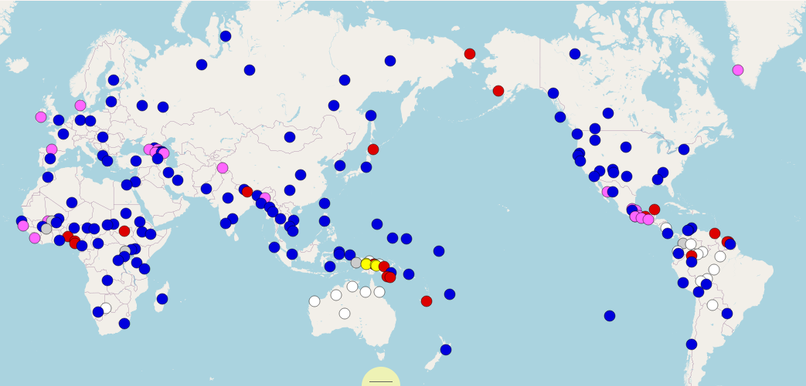
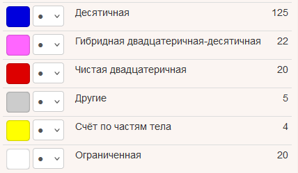
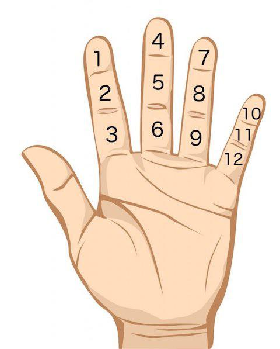

[Назад](/compsci/10b2024.html)

# Системы счисления в языках мира

У людей по десять пальцев на руках, и неудивительно, что самое часто встречающееся основание &mdash; это 10. К таким языкам относится и русский. Один из самых &laquo;чистых&raquo; примеров &mdash; китайский язык:

```
wǔ-shí      sì
five-ten    four
54 [50 + 4]
```

Но существуют и другие основания.




Например, в чукотском языке используется основание 20:

```
kəlgən-qlekken  məngətken  ŋireq  parol
fifteen-twenty  ten        two    left
312 [(15 * 20) + (10 + 2)]
```

Древние шумеры использовали шестидесятеричную систему. Именно поэтому мы делим час на 60 минут.

В некоторых языках используется двенадцатеричная система. В такой системе тоже можно считать по пальцам:


Язык бером (Нигерия):

```
ba-kuru    ba-ba   ná    CL-ā     CL-bā
PL-twelve  PL-two  plus  CL-this  CL-two
26 [(2 x 12) + 2]
```

## Счёт по частям тела

В ряде языков Новой Гвинеи используется так называемый расширенный счёт по частям тела, где, кроме пальцев, используются и другие части тела. Например, в языке кобон:

```
wañɨg nöbö     мизинец        1   23  24  46
igwo           безымянный     2   22  25  45
igwo aŋ nöbö   средний        3   21  26  44
igwo mɨlö      указательный   4   20  27  43
mamɨd          большой        5   19  28  42
kagoƚ          запястье       6   18  29  41
mudun          плечо          7   17  30  40
raleb          локоть         8   16  31  39
ajɨp           бицепс         9   15  32  38
siduŋ          плечо          10  14  33  37
agɨp           ключица        11  13  34  36
mögan          яремная ямка     12      35
```

## Смешанные системы

Иногда в системе с одним основанием появляются как бы следы другого. Как по-французски сказать &laquo;99&raquo;?

<details><summary>Ответ:</summary>
quatre-vingt-dix-neuf<br>
99 [4 * 20 + 10 + 9]<br>
</details>

В гибридных системах счёт до 100 идёт по двадцаткам, а сотни считаются десятками. Например, в баскском языке:
```
berr-eun   eta   berr-ogei-ta-hama-sei
два-сто    и     два-двадцать-и-десять-шесть
```
## Исключения

Во многих системах есть исключения, в русском языке &mdash; тоже. Попробуйте решить следующую задачу:

>Маленькому Лёве четыре года. Он учится называть числа, записанные цифрами. Многие числа &mdash; например, 0, 2, 4, 23, 31 и 35 &mdash; он называет правильно, но в некоторых делает ошибки. Так, в названиях чисел 30 и 51 он делает по одной ошибке. Обе ошибки по‑своему логичны.
>
>**Задание.** Напишите, как Лёва называет числа 30 и 51. Кратко поясните Ваше решение.

<details><summary>Ответ:</summary>
30 = тридцать ноль <br>
51 = пятьдцать один
</details>


## Ограниченные системы

Наконец, есть языки, в которых числительных очень мало. Считается, что в языке Пираха (про который сделано много разных удивительных заявлений) числительных нет вообще, а есть только слова &laquo;много&raquo; и &laquo;мало&raquo;.

Язык мундуруку (Бразилия):

```
1  püg (ma)
2  xep xep
3  ebapüg     2 + 1
4  ebadipdip  2 + 1 + 1
5  püg pögbi  ‘одна рука’
```

## Задание со звёздочкой
Даны математические выражения с числительными языка на’ви, созданного для фильма «Аватар» (2009) лингвистом Полом Фроммером.

Известно, что все числа натуральные и не превышают 100.

1. *pxey + kinä = vomun*
2. *tsìng + mrr = volaw*
3. *tsìng × mrr = mevosìng*
4. *vol × vol = zam*
5. *mune × mune = tsìng*
6. *’aw + mrr = pukap*
7. *puvomun : vomun = mrr*
8. *zamun − mrrvosìng = mevofu*
9. *tsivol + tsivohin = zahin*
10. *zam vopey − kivomrr = vofu*
11. *vosìng × mrr = kivosìng*
12. *zam tsivopey : tsivolaw = pxey*

**Задание 1.** Запишите выражения числами. Кратко поясните Ваше решение.

**Задание 2.** Как переводится с языка на’ви числительное *mezazam pxevozam puzam volaw*?

**Задание 3.** Предположите, какая физиологическая особенность народа на’ви с планеты Пандора нашла отражение в его языке.

Примечание. *px*, *ts*, *’* — особые согласные, *rr* — особый гласный языка на’ви. Знакомство с фильмом «Аватар» для решения задачи не требуется.