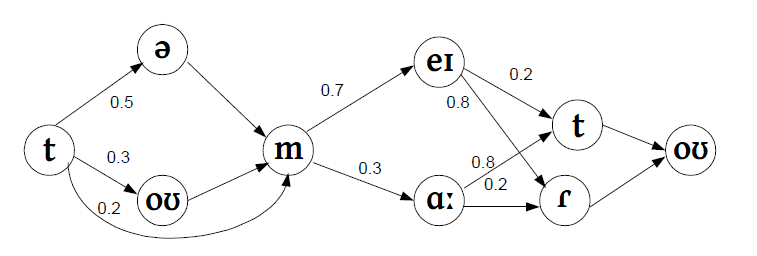

[Назад](/compsci/10a2024.html)

# Направленные графы в лингвистике

В распознавании речи часто бывает полезно хранить информацию о разных вариантах произношения одного и того же слова в виде взвешенных ориентированных графов, где вес каждой дуги будет соответствовать вероятности встретить то или иное предложение.

Например, английское слово *tomato* (&lsquo;помидор&rsquo;) имеет довольно много произносительных вариантов:

- в первом слоге может произноситься как дифтонг /oʊ/[^1], так и безударный гласный /ə/, а ещё звук может выпасть полностью;
- во втором слоге британец, скорее всего, употребит гласный /ɑː/, а американец &mdash; дифтонг /eɪ/;
- последний звук /t/ британцем будет произнесён как обычный [t], а американцем &mdash; как звонкий краткий [ɾ].

Вариант [təˈmɑːtoʊ]:

<audio controls>
    <source src="audio/En-uk-tomato.ogg" type="audio/ogg">
    Your browser does not support the audio tag.
</audio>

Вариант [təˈmeɪɾoʊ]:

<audio controls>
    <source src="audio/En-us-tomato.ogg" type="audio/ogg">
    Your browser does not support the audio tag.
</audio>

Эту информацию можно в компактном виде изобразить на графе:

Попробуйте ответить на следующие вопросы:

1. Каким будет самый часто встречающийся вариант?
1. Какова его вероятность?
1. Сколько всего разных вариантов?

Чтобы посчитать вероятность всего варианта, нужно перемножить все вероятности, написанные на его дугах.

Нажмите, чтобы увидеть ответы

<ol>
<li>[təˈmeɪɾoʊ] (что неудивительно)</li> 
<li>0.5 * 0.7 * 0.8 = 0.28</li> 
<li>3 * 2 * 2 = 12</li> 
</ol>

[^1]: В британской транскрипции принят символ /əʊ/