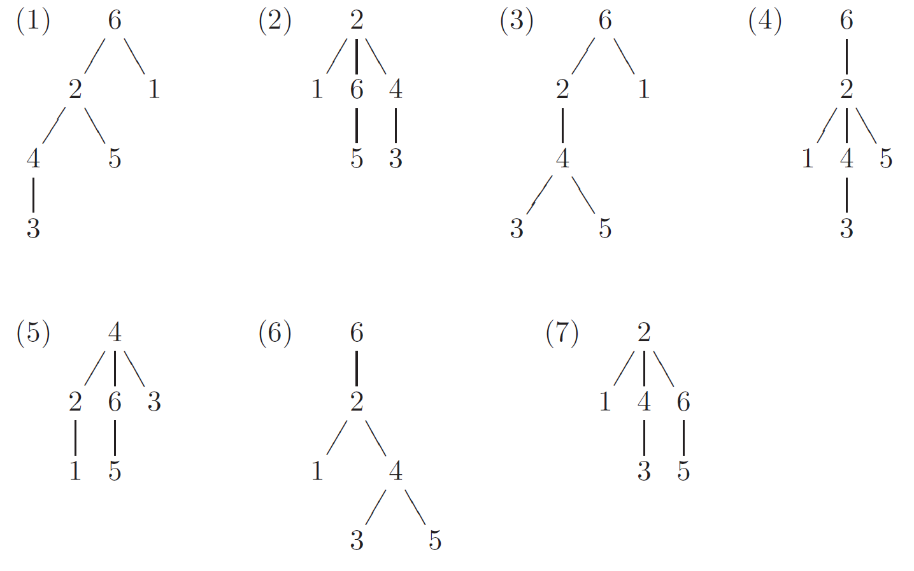

[Назад](/10a2024.html)

# Деревья в лингвистике

Вы знаете, что синтаксическую структуру предложения можно изобразить в виде дерева: на уроках русского языка вы обозначаете зависимости между членами предложения стрелками.

Попробуйте решить следующую задачу:

## Задача ([источник](http://lingproblems.online/index.php?action=problem&pid=1359&vid=1359))

Ниже приводятся предложения и несколько рисунков, именуемых графами:

1. Дорогой подарок моему другу из Парижа потерялся.
2. Я увидел в городском саду маленькую девочку.
3. Сильный человек легко поднимет этот груз.
4. Он поместит эту статью в нашем журнале.

**Задание 1.** Обнаружив закономерности, связывающие определённые графы и предложения, распределите графы между предложениями так, чтобы каждый граф соответствовал ровно одному предложению и каждому предложению соответствовал хотя бы один граф.

**Задание 2.** Укажите, какие это закономерности.

## Решение

Нажмите, чтобы увидеть решение

Главное для решения этой задачи &mdash; догадаться, что рисунки изображают схематически (и приблизительно), как предложения устроены синтаксически, т. е. с точки зрения их сказуемых, подлежащих, дополнений и пр. Как дойти до этой мысли?

 

Прежде всего, на каждой схеме ровно 6 цифр, и в каждом предложении ровно 6 значимых слов, не считая предлогов. Исходя из того, что слова, возможно, пронумерованы по их порядку в предложении, можно задуматься над тем, почему только 2, 4, и 6 появляются на вершинах схем. Оказывается, что сказуемые в четырёх предложениях занимают как раз эти места: 2 в предложениях (2) и (4), 4 в предложении (3) и 6 в предложении (1). Всегда полезно начинать с тех явлений, которые встречаются только один раз. Только рисунок (5) имеет 4 на вершине. Если он соответствует предложению (3), то 2&ndash;1 соответствуют словам человек и сильный; 6&ndash;5 &mdash; словам груз и этот; 3 &mdash; слову легко. Очевидно, самая левая ветвь на каждом рисунке соответствует подлежащему, следующая ветвь &mdash; прямому дополнению, а самая правая ветвь &mdash; остальным словам. Если это верно, то рисунок (2) соответствует предложению (2), а рисунок (7) &mdash; предложению (4).

 

Остаётся сообразить, почему 4 разных рисунка соответствуют одному и тому же предложению (6). Очевидно, его можно понять четырьмя разными способами. И, в самом деле, слово дорогой может означать прилагательное, описывающее ценность подарка, а может также означать ‘по пути’. Предложно-падежная форма из Парижа может относиться к слову подарок или к слову другу. И каждая из этих возможностей сочетается с каждой другой, что и даёт 4 возможности анализировать и понять это предложение. Так, рисунки (1) и (3) соответствуют значению ‘по пути’ для дорогой, а рисунки (4) и (6) значению ‘ценный’. Рисунки (1) и (4) относят из Парижа к слову подарок, а рисунки (3) и (6) &mdash; к слову друг.

